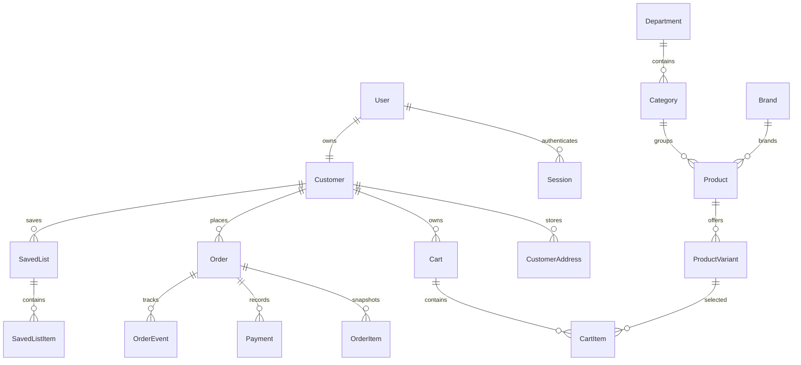

# Phase 1 relational model

InventoryReservation and InventoryMovement reference immutable variant/order IDs. SQL migrations add foreign keys and nonnegative stock/quantity constraints in addition to Prisma relationships. Price and VAT use Decimal; each order line stores its tax rate and totals.
